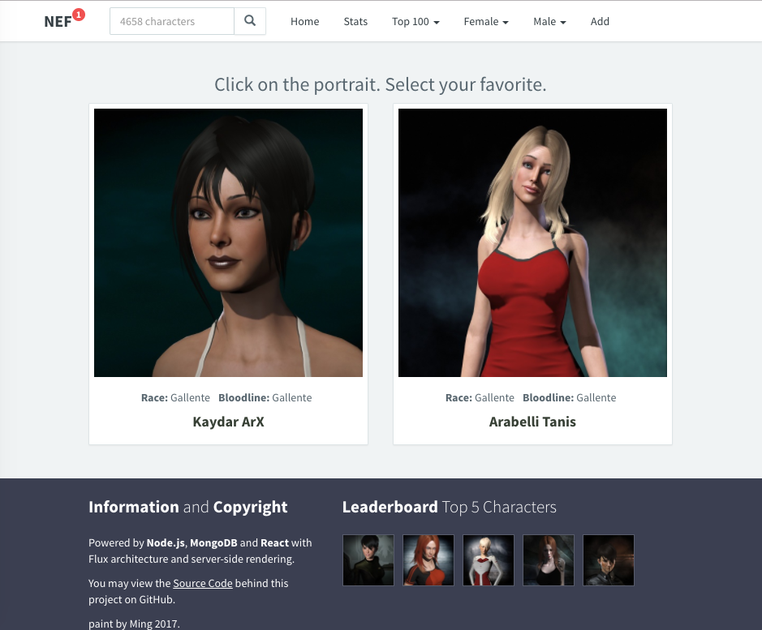
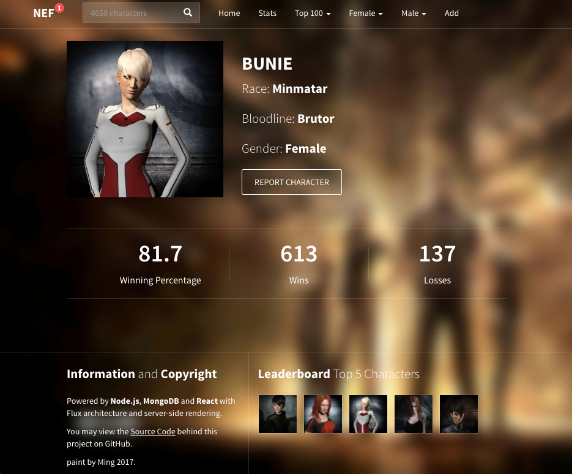

<h1>EVE Online 角色投票 demo</h1>
<h2>需要本地配置</h2>
    MongoDB 
    Node.js 
    Gulp
<h2>然后通过</h2>
    npm install 根据package.json，自动注入依赖包 
    mongorestore characters.bson 向数据库中添加角色库 
    mongo/mongod 启动数据库 
    glup 连接依赖文件、编译LESS样式并监视文件变化 
    npm start 启动项目
<h2>效果预览</h2>
<h3>主页</h3>

<h3>角色</h3>

<a href="http://sahatyalkabov.com/create-a-character-voting-app-using-react-nodejs-mongodb-and-socketio/">英文教程</a>
